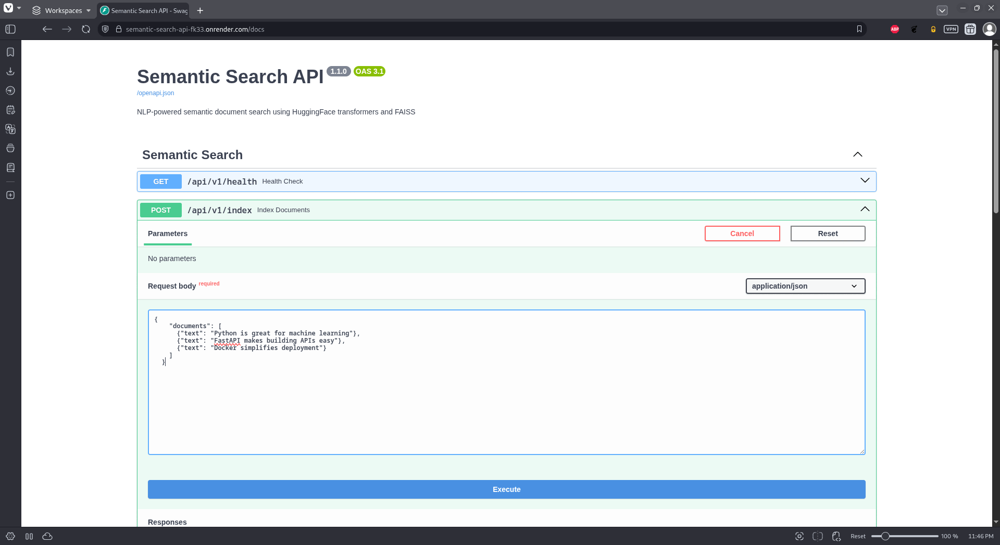
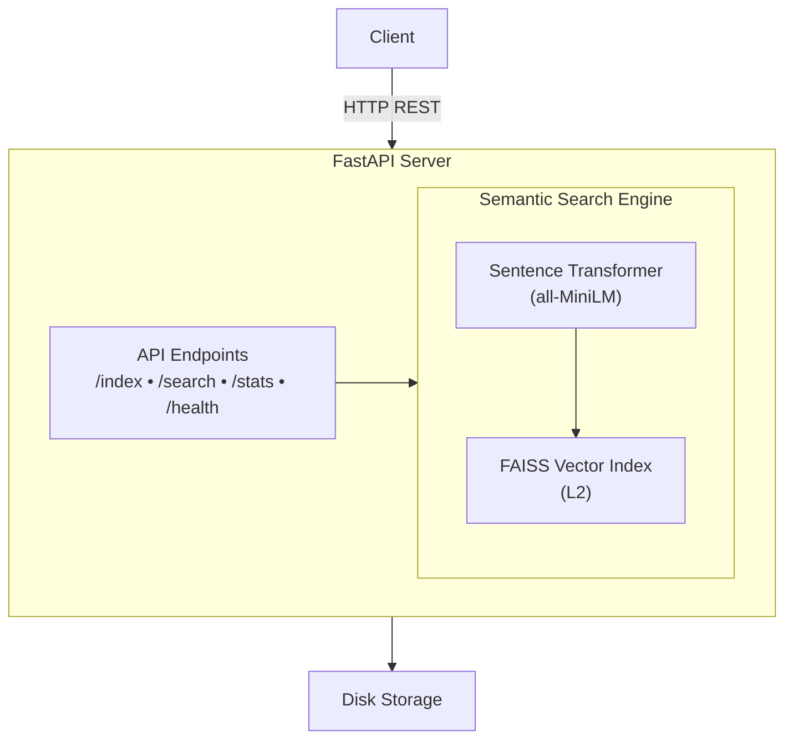

<div align="center">

# Semantic Search API

NLP-powered semantic document search using HuggingFace sentence transformers and FAISS vector similarity.

[](https://fastapi.tiangolo.com/)
[](https://python.org)
[](https://docker.com)
[](LICENSE)

</div>

## Overview

A production-ready REST API that enables semantic search over document collections. Instead of keyword matching, it understands the **meaning** of queries to find relevant documents.

**Example:**
- Query: "machine learning"
- Finds: "artificial intelligence", "neural networks", "deep learning"

**New in v1.1.0:** Docker support, sample dataset, usage examples

## Features

- 🔍 **Semantic Search** - Find documents by meaning, not just keywords
- ⚡ **Fast** - Sub-20ms query times
- 🤖 **AI-Powered** - Uses HuggingFace sentence-transformers
- 📊 **Vector Similarity** - FAISS for efficient nearest-neighbor search
- 🔌 **REST API** - Clean FastAPI endpoints with auto-generated docs
- 💾 **Persistent** - Index saved to disk, survives restarts
- 🐳 **Dockerized** - One-command deployment (new in v1.1.0)
- 📦 **Sample Data** - Pre-built dataset for testing (new in v1.1.0)
- 📚 **Examples** - Python usage examples included (new in v1.1.0)

## Technology Stack

| Component | Technology | Purpose |
|-----------|-----------|---------|
| **Framework** | FastAPI | REST API endpoints |
| **NLP** | sentence-transformers | Text → embeddings |
| **Model** | all-MiniLM-L6-v2 | 384-dim sentence vectors |
| **Vector DB** | FAISS (IndexFlatL2) | Similarity search |
| **Validation** | Pydantic | Request/response schemas |
| **Runtime** | Uvicorn | ASGI server |
| **Deployment** | Docker | Containerization |

## Quick Start

### Option 1: Docker (Recommended)
```bash
# Clone repository
git clone https://github.com/Yahia995/semantic-search-api.git
cd semantic-search-api

# Run with docker-compose
docker-compose up

# API will be available at http://localhost:8000
```

### Option 2: Local Installation
```bash
# Prerequisites
python --version  # 3.12

# Clone and setup
git clone https://github.com/Yahia995/semantic-search-api.git
cd semantic-search-api

# Create virtual environment
python -m venv venv
source venv/bin/activate  # Windows (Git Bash): venv\Scripts\activate

# Install dependencies
pip install -r requirements.txt

# Run server
uvicorn app.main:app --reload --host 0.0.0.0 --port 8000
```

**Access:**
- API docs: http://localhost:8000/docs
- Health check: http://localhost:8000/api/v1/health

## Live Demo

**Try it now:** https://semantic-search-api-fk33.onrender.com/docs

**Example queries to try:**
```bash
# Find AI/ML documents
curl -X POST https://semantic-search-api-fk33.onrender.com/api/v1/search \
  -H "Content-Type: application/json" \
  -d '{"query": "neural networks and deep learning", "top_k": 3}'

# Find backend frameworks
curl -X POST https://semantic-search-api-fk33.onrender.com/api/v1/search \
  -H "Content-Type: application/json" \
  -d '{"query": "building REST APIs", "top_k": 3}'
```

**Note:** Free tier may sleep after 15 minutes of inactivity. First request might take 30 seconds to wake up.

## Demo



*Semantic search in action: Query "building web APIs" returns documents about FastAPI and API development, even though the exact phrase does not appear in the indexed texts.*

### What's Happening

1. **Index** 3 documents related to machine learning, API development, and deployment  
   - "Python is great for machine learning"  
   - "FastAPI makes building APIs easy"  
   - "Docker simplifies deployment"

2. **Search** for `"building web APIs"` with `top_k = 2` and a score threshold of `0.3`

3. **Results** ranked by semantic similarity:
   - "FastAPI makes building APIs easy" (highest score)
   - "Python is great for machine learning" (lower but relevant score)

Notice how the system understands intent and meaning rather than relying on exact keyword matches. The query never explicitly mentions “FastAPI”, yet the most relevant document is correctly retrieved.

## API Usage

### 1. Index Documents

**Basic Example:**
```bash
curl -X POST http://localhost:8000/api/v1/index \
  -H "Content-Type: application/json" \
  -d '{
    "documents": [
      {"text": "Python is great for machine learning"},
      {"text": "FastAPI makes building APIs easy"},
      {"text": "Docker simplifies deployment"}
    ]
  }'
```

**With Metadata:**
```bash
curl -X POST http://localhost:8000/api/v1/index \
  -H "Content-Type: application/json" \
  -d '{
    "documents": [
      {
        "text": "Python programming language",
        "metadata": {"category": "programming", "year": 1991}
      }
    ]
  }'
```

**Response:**
```json
{
  "status": "success",
  "documents_indexed": 3,
  "total_documents": 3,
  "elapsed_seconds": 0.47
}
```

### 2. Search Documents

**Request:**
```bash
curl -X POST http://localhost:8000/api/v1/search \
  -H "Content-Type: application/json" \
  -d '{
    "query": "building web APIs",
    "top_k": 2,
    "score_threshold": 0.3
  }'
```

**Response:**
```json
{
  "query": "building web APIs",
  "results": [
    {
      "id": 1,
      "text": "FastAPI makes building APIs easy",
      "metadata": {},
      "score": 0.5582,
      "distance": 0.7914
    },
    {
      "id": 0,
      "text": "Python is great for machine learning",
      "metadata": {},
      "score": 0.3827,
      "distance": 1.6133
    }
  ],
  "total_results": 2,
  "elapsed_ms": 18.75
}
```

### 3. Get Statistics
```bash
curl http://localhost:8000/api/v1/stats
```

**Response:**
```json
{
  "total_documents": 20,
  "index_dimension": 384,
  "model_name": "all-MiniLM-L6-v2",
  "index_type": "IndexFlatL2"
}
```

### 4. Clear Index
```bash
curl -X DELETE http://localhost:8000/api/v1/index
```

## Examples

### Python Client Example

See [`examples/basic_usage.py`](examples/basic_usage.py) for a complete example.
```python
import requests

BASE_URL = "http://localhost:8000/api/v1"

# Index documents
response = requests.post(
    f"{BASE_URL}/index",
    json={"documents": [
        {"text": "Python is great for AI"},
        {"text": "FastAPI builds fast APIs"}
    ]}
)
print(response.json())
# {'status': 'success', 'documents_indexed': 2, ...}

# Search
response = requests.post(
    f"{BASE_URL}/search",
    json={"query": "machine learning", "top_k": 1}
)
print(response.json()['results'][0]['text'])
# 'Python is great for AI'
```

**Run the example:**
```bash
# Make sure server is running
python examples/basic_usage.py
```

### Sample Dataset

Load the pre-built sample dataset (20 documents across multiple categories):
```bash
curl -X POST http://localhost:8000/api/v1/index \
  -H "Content-Type: application/json" \
  -d @tests/sample_data.json
```

**Try these semantic queries:**
```bash
# Find AI/ML documents
curl -X POST http://localhost:8000/api/v1/search \
  -H "Content-Type: application/json" \
  -d '{"query": "neural networks and deep learning", "top_k": 3}'
# Returns: transformers, deep learning, machine learning

# Find backend frameworks
curl -X POST http://localhost:8000/api/v1/search \
  -H "Content-Type: application/json" \
  -d '{"query": "building web services", "top_k": 3}'
# Returns: FastAPI, Spring Boot, RESTful APIs

# Find DevOps tools
curl -X POST http://localhost:8000/api/v1/search \
  -H "Content-Type: application/json" \
  -d '{"query": "deployment and orchestration", "top_k": 3}'
# Returns: Kubernetes, Docker, CI/CD pipelines
```

**Sample data categories:**
- Programming (Python, TypeScript)
- AI/ML (Machine Learning, NLP, Deep Learning, Transformers)
- Backend (FastAPI, Spring Boot, REST, GraphQL)
- Frontend (React, TypeScript)
- Database (PostgreSQL, Redis, Vector DBs)
- DevOps (Docker, Kubernetes, CI/CD)
- Architecture (Microservices)

## API Endpoints

| Method | Endpoint | Description |
|--------|----------|-------------|
| `GET` | `/` | API information |
| `GET` | `/api/v1/health` | Health check |
| `POST` | `/api/v1/index` | Index documents |
| `POST` | `/api/v1/search` | Semantic search |
| `GET` | `/api/v1/stats` | Index statistics |
| `DELETE` | `/api/v1/index` | Clear all documents |

**Full interactive documentation:** http://localhost:8000/docs

## Architecture


## How It Works

1. **Indexing:**
   - Documents → Sentence Transformer → 384-dim embeddings
   - Embeddings stored in FAISS IndexFlatL2 (L2 distance metric)
   - Documents + embeddings saved to disk (`data/`)

2. **Searching:**
   - Query → Sentence Transformer → embedding
   - FAISS finds nearest neighbors (most similar embeddings)
   - L2 distance converted to similarity score: `score = 1/(1+distance)`
   - Results ranked by similarity, filtered by optional threshold

3. **Persistence:**
   - FAISS index → `data/faiss_index.index`
   - Documents → `data/faiss_index.docs` (pickle format)
   - Auto-loads on startup, auto-saves after indexing

## Docker Deployment

### Using Docker Compose (Recommended)
```bash
# Build and run
docker-compose up --build

# Run in background
docker-compose up -d

# View logs
docker-compose logs -f

# Stop
docker-compose down
```

### Using Docker Directly
```bash
# Build image
docker build -t semantic-search-api .

# Run container
docker run -d \
  -p 8000:8000 \
  -v $(pwd)/data:/app/data \
  --name semantic-search \
  semantic-search-api

# View logs
docker logs -f semantic-search

# Stop container
docker stop semantic-search
```

**Volume mounting:** The `-v` flag persists the FAISS index between container restarts.

## Project Structure
```
semantic-search-api/
├── app/
│   ├── main.py              # FastAPI application
│   ├── api/
│   │   └── routes.py        # API endpoints
│   ├── core/
│   │   └── search_engine.py # Search engine logic
│   └── models/
│       └── schemas.py       # Pydantic models
├── examples/
│   └── basic_usage.py       # Python usage example (v1.1.0)
├── tests/
│   └── sample_data.json     # Sample dataset (v1.1.0)
├── data/                    # FAISS index (gitignored)
├── venv/                    # Virtual environment (gitignored)
├── Dockerfile               # Docker image definition (v1.1.0)
├── docker-compose.yml       # Docker Compose config (v1.1.0)
├── .dockerignore            # Docker ignore rules (v1.1.0)
├── requirements.txt         # Python dependencies
├── .gitignore
├── LICENSE                  # MIT License (v1.1.0)
└── README.md
```

## Configuration

Edit `app/main.py` to customize:
```python
engine = SemanticSearchEngine(
    model_name="all-MiniLM-L6-v2",  # Or use different model
    index_path="data/faiss_index"   # Index storage path
)
```

**Model Options:**

| Model | Dimensions | Speed | Quality | Use Case |
|-------|------------|-------|---------|----------|
| `all-MiniLM-L6-v2` | 384 | Fast ⚡ | Good ✓ | Default, balanced |
| `all-mpnet-base-v2` | 768 | Slower | Better ✓✓ | Higher accuracy |
| `paraphrase-multilingual-MiniLM-L12-v2` | 384 | Fast ⚡ | Good ✓ | Multilingual 🌍 |

## Limitations

- **CPU-only** - No GPU acceleration (uses `faiss-cpu`)
- **In-memory index** - All embeddings loaded in RAM
- **Single index** - One global index, no multi-tenancy
- **No authentication** - Open API (add auth for production)
- **No pagination** - Returns top_k results only (max 100)

## Roadmap

**v1.2.0 (Planned):**
- [ ] Authentication (API keys)
- [ ] Document deletion by ID
- [ ] Batch search endpoint
- [ ] Unit tests with pytest

**v2.0.0 (Future):**
- [ ] Multiple indices support
- [ ] Hybrid search (semantic + keyword with BM25)
- [ ] Caching layer (Redis)
- [ ] Metrics & monitoring (Prometheus)
- [ ] Cloud deployment guide (Railway, Render)

## Troubleshooting

### Port already in use
```bash
# Find process using port 8000
lsof -i :8000

# Kill it
kill -9 <PID>

# Or use different port
uvicorn app.main:app --port 8080
```

### Model download fails
```bash
# Pre-download model manually
python -c "from sentence_transformers import SentenceTransformer; SentenceTransformer('all-MiniLM-L6-v2')"
```

### Index not persisting
```bash
# Check data directory exists and is writable
ls -la data/
# Should show .index and .docs files after indexing

# Ensure proper permissions
chmod 755 data/
```

### Docker container issues
```bash
# View container logs
docker-compose logs api

# Rebuild without cache
docker-compose build --no-cache

# Check container status
docker-compose ps
```

## Contributing

Contributions are welcome! Please:

1. Fork the repository
2. Create a feature branch (`git checkout -b feature/amazing-feature`)
3. Commit your changes (`git commit -m 'Add amazing feature'`)
4. Push to the branch (`git push origin feature/amazing-feature`)
5. Open a Pull Request

## License

MIT License - see [LICENSE](LICENSE) file for details.

## Acknowledgments

- **[sentence-transformers](https://www.sbert.net/)** - Pre-trained embedding models
- **[FAISS](https://github.com/facebookresearch/faiss)** - Efficient similarity search by Facebook Research
- **[FastAPI](https://fastapi.tiangolo.com/)** - Modern Python web framework
- **[HuggingFace](https://huggingface.co/)** - Transformers ecosystem

---

<div align="center">

**Built with ❤️ for semantic search**

*Find documents by meaning, not just keywords*

</div>
