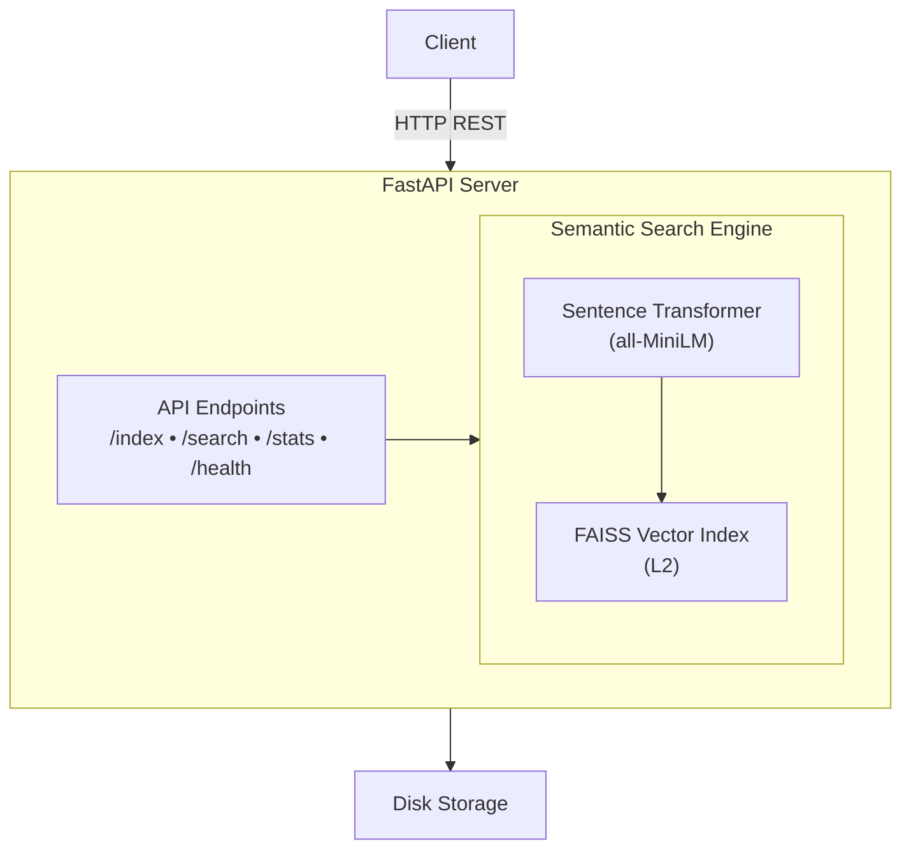

<div align="center">

# Semantic Search API

NLP-powered semantic document search using HuggingFace sentence transformers and FAISS vector similarity.

[](https://fastapi.tiangolo.com/)
[](https://python.org)
[](LICENSE)

</div>

## Overview

A REST API that enables semantic search over document collections. Instead of keyword matching, it understands the **meaning** of queries to find relevant documents.

**Example:**
- Query: "machine learning"
- Finds: "artificial intelligence", "neural networks", "deep learning"

## Features

- 🔍 **Semantic Search** - Find documents by meaning, not just keywords
- ⚡ **Fast** - Sub-100ms query times
- 🤖 **AI-Powered** - Uses HuggingFace sentence-transformers
- 📊 **Vector Similarity** - FAISS for efficient nearest-neighbor search
- 🔌 **REST API** - Clean FastAPI endpoints with auto-generated docs
- 💾 **Persistent** - Index saved to disk, survives restarts

## Technology Stack

| Component | Technology | Purpose |
|-----------|-----------|---------|
| **Framework** | FastAPI | REST API endpoints |
| **NLP** | sentence-transformers | Text → embeddings |
| **Model** | all-MiniLM-L6-v2 | 384-dim sentence vectors |
| **Vector DB** | FAISS (IndexFlatL2) | Similarity search |
| **Validation** | Pydantic | Request/response schemas |
| **Runtime** | Uvicorn | ASGI server |

## Quick Start

### Prerequisites
```bash
python --version  # 3.12
```

### Installation
```bash
# Clone repository
git clone https://github.com/Yahia995/semantic-search-api.git
cd semantic-search-api

# Create virtual environment
python -m venv venv
source venv/bin/activate  # Windows (Git Bash): venv\Scripts\activate

# Install dependencies
pip install -r requirements.txt
```

### Run Server
```bash
uvicorn app.main:app --reload --host 0.0.0.0 --port 8000
```

**Visit:**
- API docs: http://localhost:8000/docs
- Health check: http://localhost:8000/api/v1/health

## API Usage

### 1. Index Documents

**Request:**
```bash
curl -X POST http://localhost:8000/api/v1/index \
  -H "Content-Type: application/json" \
  -d '{
    "documents": [
      {"text": "Python is great for machine learning"},
      {"text": "FastAPI makes building APIs easy"},
      {"text": "Docker simplifies deployment"}
    ]
  }'
```

**Response:**
```json
{
  "status": "success",
  "documents_indexed": 3,
  "total_documents": 3,
  "elapsed_seconds": 0.47
}
```

### 2. Search Documents

**Request:**
```bash
curl -X POST http://localhost:8000/api/v1/search \
  -H "Content-Type: application/json" \
  -d '{
    "query": "building web APIs",
    "top_k": 2
  }'
```

**Response:**
```json
{
  "query": "building web APIs",
  "results": [
    {
      "id": 1,
      "text": "FastAPI makes building APIs easy",
      "metadata": {},
      "score": 0.5582,
      "distance": 0.7914
    },
    {
      "id": 0,
      "text": "Python is great for machine learning",
      "metadata": {},
      "score": 0.3827,
      "distance": 1.6133
    }
  ],
  "total_results": 2,
  "elapsed_ms": 18.75
}
```

### 3. Get Statistics

**Request:**
```bash
curl http://localhost:8000/api/v1/stats
```

**Response:**
```json
{
  "total_documents": 3,
  "index_dimension": 384,
  "model_name": "all-MiniLM-L6-v2",
  "index_type": "IndexFlatL2"
}
```

### 4. Clear Index

**Request:**
```bash
curl -X DELETE http://localhost:8000/api/v1/index
```

**Response:** `204 No Content`

## API Endpoints

| Method | Endpoint | Description |
|--------|----------|-------------|
| `GET` | `/` | API information |
| `GET` | `/api/v1/health` | Health check |
| `POST` | `/api/v1/index` | Index documents |
| `POST` | `/api/v1/search` | Semantic search |
| `GET` | `/api/v1/stats` | Index statistics |
| `DELETE` | `/api/v1/index` | Clear all documents |

**Full documentation:** http://localhost:8000/docs

## Architecture


## How It Works

1. **Indexing:**
   - Documents → Sentence Transformer → 384-dim embeddings
   - Embeddings stored in FAISS IndexFlatL2 (L2 distance metric)
   - Documents + embeddings saved to disk

2. **Searching:**
   - Query → Sentence Transformer → embedding
   - FAISS finds nearest neighbors (most similar embeddings)
   - L2 distance converted to similarity score: `score = 1/(1+distance)`
   - Results ranked by similarity

3. **Persistence:**
   - FAISS index → `data/faiss_index.index`
   - Documents → `data/faiss_index.docs` (pickle format)
   - Auto-loads on startup, auto-saves after indexing

## Project Structure
```
semantic-search-api/
├── app/
│   ├── main.py              # FastAPI application
│   ├── api/
│   │   └── routes.py        # API endpoints
│   ├── core/
│   │   └── search_engine.py # Search engine logic
│   └── models/
│       └── schemas.py       # Pydantic models
├── data/                    # FAISS index (gitignored)
├── venv/                    # Virtual environment (gitignored)
├── requirements.txt         # Python dependencies
├── .gitignore
├── LICENSE                  # MIT License
└── README.md
```

## Configuration

Edit `app/main.py` to customize:
```python
engine = SemanticSearchEngine(
    model_name="all-MiniLM-L6-v2",  # Or use different model
    index_path="data/faiss_index"   # Index storage path
)
```

**Model Options:**

| Model | Dimensions | Speed | Quality |
|-------|------------|-------|---------|
| `all-MiniLM-L6-v2` | 384 | Fast ⚡ | Good ✓ |
| `all-mpnet-base-v2` | 768 | Slower | Better ✓✓ |
| `paraphrase-multilingual-MiniLM-L12-v2` | 384 | Fast ⚡ | Multilingual 🌍 |

## Development

### Testing
```bash
# Run health check
curl http://localhost:8000/api/v1/health

# Index test documents
curl -X POST http://localhost:8000/api/v1/index \
  -H "Content-Type: application/json" \
  -d '{"documents": [{"text": "Test document"}]}'

# Search test
curl -X POST http://localhost:8000/api/v1/search \
  -H "Content-Type: application/json" \
  -d '{"query": "test", "top_k": 1}'
```

### Adding Documents with Metadata
```bash
curl -X POST http://localhost:8000/api/v1/index \
  -H "Content-Type: application/json" \
  -d '{
    "documents": [
      {
        "text": "Python programming language",
        "metadata": {"category": "programming", "year": 1991}
      }
    ]
  }'
```

Metadata is returned in search results but not used for ranking.

## Limitations

- **CPU-only** - No GPU acceleration (uses `faiss-cpu`)
- **In-memory index** - All embeddings loaded in RAM
- **Single index** - One global index, no multi-tenancy
- **No authentication** - Open API (add auth for production)
- **No pagination** - Returns top_k results only (max 100)

## Roadmap

**Future enhancements:**

- [ ] Docker containerization
- [ ] Authentication (API keys)
- [ ] Multiple indices support
- [ ] Batch search endpoint
- [ ] Document deletion by ID
- [ ] Hybrid search (semantic + keyword)
- [ ] Caching layer (Redis)
- [ ] Metrics & monitoring

## Troubleshooting

### Port already in use
```bash
# Find process using port 8000
lsof -i :8000

# Kill it
kill -9 <PID>
```

### Model download fails
```bash
# Pre-download model
python -c "from sentence_transformers import SentenceTransformer; SentenceTransformer('all-MiniLM-L6-v2')"
```

### Index not persisting
```bash
# Check data directory exists and is writable
ls -la data/
# Should show .index and .docs files after indexing
```

## License

MIT License - see [LICENSE](LICENSE) file for details.

## Acknowledgments

- **[sentence-transformers](https://www.sbert.net/)** - Pre-trained embedding models
- **[FAISS](https://github.com/facebookresearch/faiss)** - Efficient similarity search
- **[FastAPI](https://fastapi.tiangolo.com/)** - Modern Python web framework

---

<div align="center">

Built with ❤️ for semantic search

</div>
